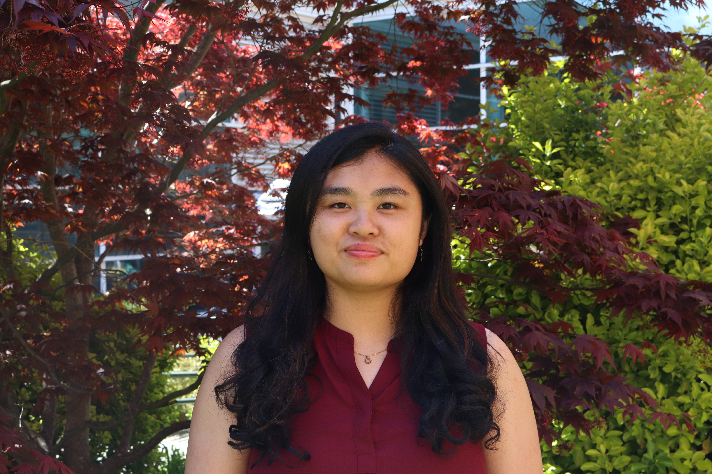

<h1>Hi, I’m <b>Evelyn Sun 👋</b></h1>

<ul>
  <li>💻 I’m a rising junior at <b>Stony Brook University</b>, majoring in Computer Science and Applied Math and Statistics and specializing in Artificial Intelligence.</li>
  <li>👩🏻‍💻 Vice President of the <b>Women in Science and Engineering Honors Program</b>.</li>
  <li>⚙️ Member of the <b>Tau Beta Pi Engineering Honor Society</b>, recognizing academic excellence in engineering.</li>
  <li>🧠 Interning at <b>M&T Bank</b>, where I built an internal chatbot and trained ML models for enterprise solutions.</li>
  <li>🔬 Participated in a <b>DOE-funded research internship</b> at Brookhaven National Lab, optimizing machine learning algorithms for neutron classification.</li>
  <li>🎓 Selected as a <b>Breakthrough Tech AI Fellow</b> to complete real-world AI/ML projects and gain mentorship in the AI industry.</li>
  <li>🛠️ Experienced with full-stack web development, REST APIs, and deploying responsive applications.</li>
</ul>

🧰 <b>Languages & Tools:</b>  
Java • Python • C • HTML • CSS • JavaScript • React • Node.js • Express • MongoDB • SQL • Angular • Git • TensorFlow • scikit-learn • pandas • NumPy

📫 <b>Contact Me:</b>  
• 📧 evelynsun632@gmail.com  
• 💼 <a href="https://www.linkedin.com/in/evelyn-sun-845642296/" target="_blank">LinkedIn</a>  
• 💻 <a href="https://github.com/e2sun" target="_blank">GitHub</a>  
